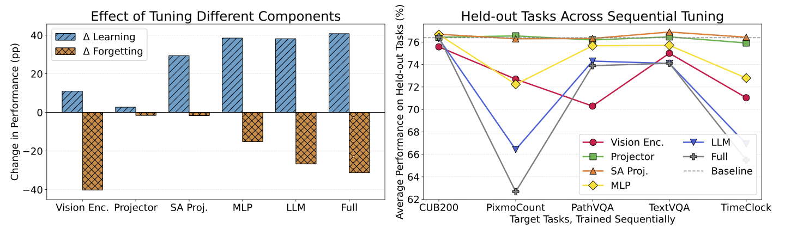

# How To Teach Large Multimodal Models New Skills?

This repository accompanies our study on how to teach Large Multimodal Models (LMMs) new skills without degrading existing capabilities. We analyze where to tune (vision encoder, projector, LLM) and, within the LLM, contrast self‑attention projection (SA Proj.) vs MLP updates under a controlled skill‑acquisition protocol. We provide a reproducible evaluation suite (target vs held‑out benchmarks), modular training scripts for component‑wise tuning, and a few optional mitigation baselines. The code builds upon [LLaVA‑OneVision/NeXT](https://github.com/LLaVA-VL/LLaVA-NeXT).

<p align="center" width="100%">
  
</p>

## Features

- **Component-wise Tuning Recipes:** SA Proj. and MLP Gate&Up options that achieve strong learning with minimal forgetting across tasks and model families.
- **Controlled Evaluation:** Five target skills and eight held‑out benchmarks measuring both learning (target gains) and forgetting (held‑out drops).
- **Modular Experiment Scripts:** Reproducible, configurable pipelines to tune specific components (vision, projector, LLM, SA Proj., MLP) and compare recipes.
- **Optional Baselines/Mitigations:** LoRA (PEFT), Learning without Forgetting (distillation), WiSE‑FT, and MoE provided as reference implementations.
- **Flexible Data Handling:** Utilities to fetch/convert datasets into the required format.
- **Analysis Tools:** Scripts to probe output‑distribution shift and aggregate evaluation results.

## Quick Start with Minimal Codes to Select What You Train

We developed that only tuning the SA Proj. or MLP Gate&Up are effective for adapting large multimodal models with minimal forgetting. You can do this in just a few lines by filtering parameter names. Example:

```python
# 1) Freeze everything first
for p in model.parameters():
    p.requires_grad = False

# 2a) Unfreeze ONLY self-attention projections (SA Proj.) in the LLM
sa_keys = (
    "self_attn.q_proj", "self_attn.k_proj", "self_attn.v_proj", "self_attn.o_proj"
)
for name, p in model.named_parameters():
    if any(k in name for k in sa_keys):
        p.requires_grad = True

# 2b) (Alternative) Unfreeze ONLY MLP Gate & Up; keep Down frozen
# Comment-out 2a and use this block instead
gate_up_keys = ("mlp.gate_proj", "mlp.up_proj")
down_keys    = ("mlp.down_proj")
for name, p in model.named_parameters():
    if any(k in name for k in gate_up_keys):
        p.requires_grad = True
    elif any(k in name for k in down_keys):
        p.requires_grad = False  # explicit for clarity

# ... proceed to wrap with your Trainer/optimizer, etc.
```

Tip: The built‑in flags shown above implement the same logic internally and are robust across model families. Use the snippet when you want to prototype custom selections inline.

## Table of Contents

- [How To Teach Large Multimodal Models New Skills?](#how-to-teach-large-multimodal-models-new-skills)
  - [Features](#features)
  - [Quick Start with Minimal Codes to Select What You Train](#quick-start-with-minimal-codes-to-select-what-you-train)
  - [Table of Contents](#table-of-contents)
  - [Installation](#installation)
  - [Dataset Preparation](#dataset-preparation)
  - [Running Experiments](#running-experiments)
  - [Evaluation](#evaluation)
    - [Key Evaluation Features](#key-evaluation-features)
  - [Project Structure](#project-structure)
  - [Acknowledgement](#acknowledgement)
  - [Citation](#citation)

## Installation

1.  **Clone the repository:**
    ```bash
    git clone https://github.com/jessemelpolio/LMM_CL.git
    cd LMM_CL
    ```

2.  **Create and activate an environment:**
    ```bash
    conda create -n lmm_cl python=3.10 -y
    conda activate lmm_cl
    ```

3.  **Install dependencies:**
    - Editable install with training extras, plus the bundled evaluation toolkit:
      ```bash
      pip install --upgrade pip  # Enable PEP 660 support.
      pip install -e ".[train]"
      pip install -e ./lmms-eval
      ```
    - Alternatively, you can start from the provided environment spec and then install the packages above:
      ```bash
      conda env create -f environment.yaml
      conda activate lmm_cl   # environment name from the YAML
      pip install -e ".[train]" && pip install -e ./lmms-eval
      ```

4.  **Configure access (recommended):**
    - For Hugging Face datasets: `huggingface-cli login`
    - For PixMo-Count (Flickr): obtain API credentials (see [Dataset Preparation Guide](./docs/data_preparation.md)). Prefer environment variables over hardcoding keys in code.

## Dataset Preparation

Detailed instructions for downloading and preparing the datasets used in our experiments are provided in a separate document.

➡️ **[Dataset Preparation Guide](./docs/data_preparation.md)**

This guide covers the setup for datasets such as CUB-200, PixMo-Count, PathVQA, TextVQA, and more.

## Running Experiments

We provide a suite of shell scripts to run various continual learning experiments. For detailed instructions on how to configure and run these experiments, please refer to our experiments guide.

➡️ **[Running Experiments Guide](./docs/running_experiments.md)**

This guide explains how to run different CL strategies, from simple sequential fine-tuning to more advanced methods like LoRA, LwF, and MoE.

## Evaluation

We use the [`lmms-eval`](https://github.com/EvolvingLMMs-Lab/lmms-eval) toolkit to evaluate target‑task learning and held‑out‑task forgetting in a standardized, reproducible way:

- **Learning (target):** Improvement on newly learned skills
- **Forgetting (held‑out):** Average drop on general benchmarks
- **Overall:** Trade‑offs across recipes and components

### Key Evaluation Features

- **Automatic Integration:** All experiment scripts automatically evaluate models after each training stage
- **Comprehensive Benchmarks:** Commonly evaluates on CUB-200, PixMo-Count, TextVQA, PathVQA, AI2D, ChartQA, DocVQA, InfoVQA, RealWorldQA, SEEDBench, ScienceQA, MM-Star, TimeClock, and optionally CocoClock/OpenImgClock/OCRBench/CountBench depending on the script’s `ALL_BENCHMARKS`
- **Custom Tasks:** Includes custom lmms-eval tasks for the continual learning datasets
- **Detailed Results:** Saves both aggregated metrics and per-sample results for analysis
- **Standalone Evaluation:** Can evaluate any checkpoint independently of training

**Example evaluation command:**
```bash
accelerate launch --num_processes=2 -m lmms_eval \
  --model llava_onevision \
  --model_args pretrained=/path/to/checkpoint,conv_template=qwen_1_5,model_name=llava_qwen,vocab_size=152064 \
  --tasks cub200,pixmocount,textvqa,pathvqa \
  --batch_size 1 --log_samples --output_path ./results
```

See the [Running Experiments Guide](./docs/running_experiments.md) for the exact benchmarks string used by each script and how to customize it.

## Project Structure

Here is an overview of the key directories in this project:

-   `llava/`: Core code for the LLaVA model, training, and inference logic.
-   `scripts/all_experiments/`: Scripts and configurations for running continual learning experiments (tune parts, LoRA, LwF, MoE, WiSE‑FT, etc.).
    -   `*.yaml`: Dataset configuration files.
-   `utils/`: Utility scripts for dataset preparation, results processing, and model manipulation.
-   `docs/`: Contains detailed documentation, including guides for data preparation and running experiments.
-   `lmms-eval/`: The evaluation framework used to benchmark model performance.

## Acknowledgement

- This project is built upon the [LLaVA-NeXT](https://github.com/LLaVA-VL/LLaVA-NeXT) repository. We thank the original authors for their great work.
- [Vicuna](https://github.com/lm-sys/FastChat): the codebase we built upon, and our base model Vicuna-13B that has the amazing language capabilities!
- We thank the contributors to the `lmms-eval` framework for their support on the evaluation side.

## Citation

If you find our work useful for your research, please cite:

BibTeX:
```bibtex
@article{zhu2025teachlmm,
  title  = {How To Teach Large Multimodal Models New Skills?},
  author = {Zhu, Zhen and Gong, Yiming and Xiao, Yao and Liu, Yaoyao and Hoiem, Derek},
  journal = {https://arxiv.org/abs/2510.08564},
  year   = {2025}
}
```
